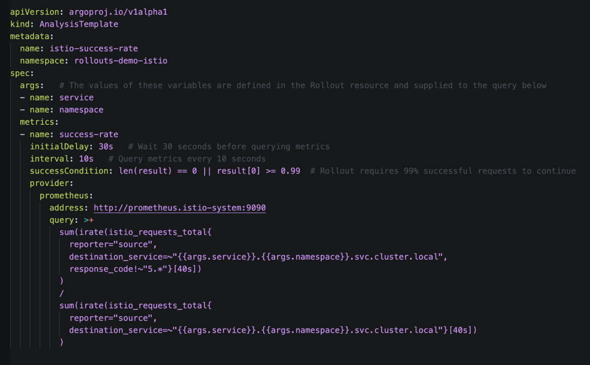

# Demo an Automated Canary Deployment on Kubernetes with Argo Rollouts, Istio, and Prometheus

> Building stuff is fun! Let's use Argo Rollouts, Istio, and Prometheus to automate a canary deployment on Kubernetes!

> The application we'll run is the [Argo Rollouts Demo Application](https://github.com/argoproj/rollouts-demo/tree/master) which does a great job of visualizing how traffic is slowly routed from from the older, stable version of the application to the newer "canary" version.

## Prerequisites

required
* [Helm](https://helm.sh/docs/intro/install/)
* [hey](https://github.com/rakyll/hey) (HTTP load generator)
* [kubectl](https://kubernetes.io/docs/tasks/tools/#kubectl)
* [yq](https://github.com/mikefarah/yq) (YAML processor)
* [Argo Rollouts Kubectl plugin](https://argoproj.github.io/argo-rollouts/installation/#kubectl-plugin-installation)

optional
* [Google Cloud Project with Kubernetes API enabled](https://console.cloud.google.com/marketplace/product/google/container.googleapis.com)
* [gcloud CLI](https://cloud.google.com/sdk/docs/install), authorized to access Google Cloud


## Prepare the Environment
### Clone the repository
```
git clone https://github.com/wiggitywhitney/argo-rollouts-istio-prometheus.git

cd argo-rollouts-istio-prometheus
```

### Create the Cluster

> Make a GKE cluster with the instructions below.

> Or you can create a Kubernetes cluster on your own, of any flavor, as long as it has an external load balancer that [supports an Istio Gateway resource](https://istio.io/latest/docs/tasks/traffic-management/ingress/ingress-control/#determining-the-ingress-ip-and-ports).

> (As a side note, did you know that [there is a load balancer for KIND](https://github.com/kubernetes-sigs/cloud-provider-kind)?)

```
export KUBECONFIG=$PWD/kubeconfig.yaml

# You will need to rerun this command any time you open a new terminal window, to connect to your cluster
```
```
export USE_GKE_GCLOUD_AUTH_PLUGIN=True
```
```
# Replace `[...]` with your Google Cloud Project ID
export PROJECT_ID=[...]
```
```
export CLUSTER_NAME=rollouts-$(date +%Y%m%d%H%M)
```
```
gcloud container clusters create $CLUSTER_NAME --project $PROJECT_ID \
          --zone us-east1-b --machine-type e2-standard-4 \
          --enable-autoscaling --num-nodes 1 --min-nodes 1 \
          --max-nodes 3 --enable-network-policy \
          --no-enable-autoupgrade

```

### Install Istio

```
helm upgrade --install istio-base base \
    --repo https://istio-release.storage.googleapis.com/charts \
    --namespace istio-system --create-namespace --wait

helm upgrade --install istiod istiod \
    --repo https://istio-release.storage.googleapis.com/charts \
    --namespace istio-system --wait

helm upgrade --install istio-ingress gateway \
    --repo https://istio-release.storage.googleapis.com/charts \
    --namespace istio-system
```

### Verify Istio Installation & Get external IP

```
kubectl -n istio-system get svc
# Wait for the External IP field of the istio-ingress service to be populated with an IP address
```
```
export ISTIO_IP=$(kubectl --namespace istio-system \
    get service istio-ingress \
    --output jsonpath="{.status.loadBalancer.ingress[0].ip}")
```
```
echo $ISTIO_IP

# This is the IP address by which you can access applications running in your cluster!
```

### Install Prometheus and connect to the Prometheus dashboard

```
kubectl apply -f https://raw.githubusercontent.com/istio/istio/release-1.24/samples/addons/prometheus.yaml
```
```
kubectl port-forward svc/prometheus -n istio-system 9090:9090 &
```
> View Prometheus at http://localhost:9090/ and verify that it is receiving Istio metrics by typing `istio` into the expression field and seeing whether any available metrics populate into the drop-down menu.

### A note about queries

> Below are the PromQL queries we'll use later to help verify the success of our rollout. You don't need to do anything with them now.

> This query computes the total rate of successful requests (non-5xx responses) to the istio-rollout-canary service:
```
sum(
  irate(
    istio_requests_total{destination_service=~"istio-rollout-canary.rollouts-demo-istio.svc.cluster.local",reporter="source",response_code!~"5.*"}[40s]
  )
)
```

> This query computes the total rate of all requests (regardless of response code) to the istio-rollout-canary service:
```
sum(
  irate(
    istio_requests_total{destination_service=~"istio-rollout-canary.rollouts-demo-istio.svc.cluster.local",reporter="source"}[40s]
  )
)

```
> Later for our success condition we'll divide the rate of successful requests by the rate of all requests, which will give us our success rate. If we have no failing requests, that will give us a success rate of `1`.


### Install Argo Rollouts

```
kubectl create ns argo-rollouts

kubectl apply -n argo-rollouts -f https://github.com/argoproj/argo-rollouts/releases/latest/download/install.yaml
```

### Create the Networking Resources


> Store the hostname in a variable.
```
export HOST=wiggitywhitney.$ISTIO_IP.nip.io
```
> Verify. This is the address where we'll be able to access our running application later!
```
echo $HOST
```

> Modify the `virtualservice.yaml` file to use $HOST as the host.

```
yq --inplace ".spec.hosts[0] = \"$HOST\"" \
    virtualservice.yaml
```

> Apply the Namespace, Gateway, Services, and VirtualService resources. 
```
kubectl apply -f namespace.yaml -f gateway.yaml -f services.yaml -f virtualservice.yaml
```

<!--- As a side note, I spent forever troubleshooting why Istio wouldn't work and it ended up being the `istio: ingressgateway` selector on the Gateway resource. I needed to change it to `istio: ingress` since I installed Istio using Helm. --->

> Make sure Istio is working correctly.
```
curl -i $HOST
```
> This returns a 503 error but also lets you know that the request is hitting an istio-envoy server.


## Demo Time!
### Run the Argo Rollouts demo application

> Start running the load tester.
```
hey -z 60m "http://$HOST/" &
```
> Apply the AnalysisTemplate and Rollout resources. 

```
kubectl apply -f analysis.yaml -f rollout.yaml
```

> Now let's think about what we just deployed!

> First let's view and discuss our [Rollout](https://argoproj.github.io/argo-rollouts/features/specification/) Argo Rollouts resource. A `Rollout` replaces the Kubenetes `Deployment` object. 

> The `spec` section is very similar to that of a Kubernetes `Deployment`, and the `Rollouts` resource also introduces a `strategy` section. 

> Learn more about what's happening in the `strategy` section by viewing the yaml comments:

```
cat rollout.yaml
```


Now let's view and discuss the Argo Rollouts resource called an [AnalysisTemplate](https://argoproj.github.io/argo-rollouts/architecture/#analysistemplate-and-analysisrun). It stores our success conditions and is reusable.

Here you see those PromQL queries we discussed earlier!

You can see more specific information in the yaml comments:

```
cat analysis.yaml
```


> By now our application should be fully deployed!

### There is so much to see!

> The running application!
```
echo "http://$HOST/"

# open the url from the output!
```
> Argo Rollouts Dashboard!
```
kubectl argo rollouts dashboard -n rollouts-demo-istio &

# Argo Rollouts Dashboard is now available at http://localhost:3100/rollouts 
```
> Watch the rollout status!
```
# open a new tab in your terminal
# you might need to run `export KUBECONFIG=$PWD/kubeconfig.yaml` again to connect to your cluster

kubectl argo rollouts get rollout istio-rollout -n rollouts-demo-istio --watch
```

### Update your rollout! Watch all the things!
```
kubectl argo rollouts -n rollouts-demo-istio set image istio-rollout "*=argoproj/rollouts-demo:yellow"
```

### Manually promote the rollout

> Based on our `Rollout` definition, 10% of traffic is going to the new release. The rollout then pauses and waits for manual promotion. 

> View 10% yellow squares in the running application!
```
echo "http://$HOST/"

# open the url from the output!
```

> Use either the command line or the web UI to promote the rollout.
```
kubectl argo rollouts -n rollouts-demo-istio promote istio-rollout

# or press the 'promote' button in the UI!
```

> And now we're off! Wheeeeee! Watch all of the things: your live application, the Argo Rollouts dashboard, and the terminal tab containing the output of the `watch` command.

> As long as the traffic is flowing successfully, the new app will get promoted and eventually receive 100% of traffic, and at that point the old app will scale down.

> See the `AnalysisRun` progress in the UI by clicking the `Analysis-*` button associated with the current revision, or by running the following command:
```
kubectl -n rollouts-demo-istio get analysisrun

# Replace `[...]` with then name of the analysisrun you want to see

kubectl -n rollouts-demo-istio describe analysisrun [...]
```
> ... and they were all yellow!  ♫ 

### Wait. What is an `AnalysisRun`?

> An `AnalysisRun` is an instantiation of an `AnalysisTemplate`. As we went over, an `AnalysisTemplate` contains instructions about what metrics to query. The actual result, attached to a specific `Rollout`, is the `AnalysisRun` custom resource. The `AnalysisRun` resource is scoped on a specific rollout.

### What if the new application sucks?

> Let's simulate a failing application.
```
kubectl argo rollouts -n rollouts-demo-istio set image istio-rollout "*=argoproj/rollouts-demo:bad-purple"
```

> In a minute or two, the rollout will fail and the application will be rolled out to the previous stable version.

> If it takes a long time to fail, try killing the load generator `hey`.

> The Argo Rollouts dashboard has a bug where we can't click into the AnalysisRun and see what failed exactly. But we can see it with `kubectl` by getting and describing the related `AnalysisRun`.
```
kubectl -n rollouts-demo-istio get analysisrun

# Replace `[...]` with then name of the analysisrun you want to see

kubectl -n rollouts-demo-istio describe analysisrun [...]
```
> After a failure, our rollout is `Degraded`. To be able to do anything else, we need to make our rollout `Healthy` again by changing the desired state back to the previous, stable version. This ensures that our desired state is aligned with our actual state.

```
kubectl argo rollouts -n rollouts-demo-istio set image istio-rollout "*=argoproj/rollouts-demo:yellow"
```

### We did it! Huzzah!!!

> That's it! We did the thing! But feel free to keep playing in this environment we made. Go ahead, tweak some yaml and see what happens! And play with other `rollouts-demo` application images. Available image colors are red, orange, yellow, green, blue, and purple. There are also high error rate images, prefixed with the word `bad` (e.g. `argoproj/rollouts-demo:bad-yellow`), and high latency images, prefixed with the word `slow` (e.g. `argoproj/rollouts-demo:slow-yellow`).

> As a reminder, you can imperatively change the rollout image with the `argo rollouts` `set image` command, like so:
```
kubectl argo rollouts -n rollouts-demo-istio set image istio-rollout "*=argoproj/rollouts-demo:green"
```

### Further learning and playing

> [Argo Rollouts Getting Started Guide](https://argoproj.github.io/argo-rollouts/getting-started/) - Approachable!

> [Argo Rollouts Demo Application](https://github.com/argoproj/rollouts-demo/tree/master) - The demo you just completed is based on the [istio example](https://github.com/argoproj/rollouts-demo/tree/master/examples/istio) from this!

